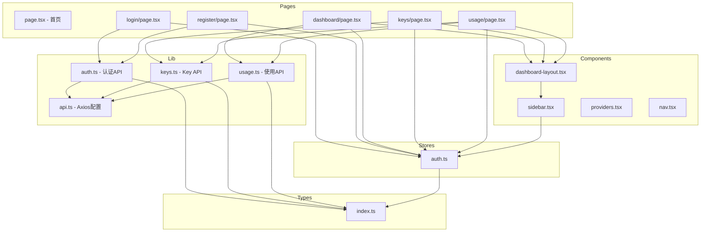

# PROJECT_INDEX.md - GEB L1 项目索引

> **本文件是 GEB L1 索引，任何项目结构或重要文件变更后必须更新我**
> 最后更新: 2026-05-14

## 项目概述

Sub2API Web 是 Sub2API AI Gateway 平台的前端应用，为用户提供 API Key 管理和 Token 使用追踪功能。采用现代 HeroUI 组件库构建，提供美观的用户界面。

## 架构概述

```
┌─────────────────────────────────────────────────────────────┐
│                     Browser (React App)                      │
├─────────────────────────────────────────────────────────────┤
│  Pages (App Router)    │  Components  │  Stores (Zustand)   │
│  - /                   │  - Sidebar   │  - auth.ts          │
│  - /login              │  - Layout    │                     │
│  - /register           │              │                     │
│  - /dashboard          │              │                     │
│  - /keys               │              │                     │
│  - /usage              │              │                     │
├─────────────────────────────────────────────────────────────┤
│                 Lib Layer (API Clients)                      │
│  - auth.ts (认证)     │  - keys.ts (API Key) │  - usage.ts │
├─────────────────────────────────────────────────────────────┤
│                     Types (index.ts)                         │
│  - User, ApiKey, UsageLog, DashboardStats, etc.              │
├─────────────────────────────────────────────────────────────┤
│                   Backend API (Go + Gin)                     │
│  REST API: /api/v1/auth, /api/v1/keys, /api/v1/usage        │
└─────────────────────────────────────────────────────────────┘
```

## 技术栈

| 层级 | 技术 | 版本 |
|------|------|------|
| 框架 | Next.js (App Router) | 15.2.4 |
| UI库 | HeroUI React | 3.0.4 |
| 样式 | Tailwind CSS | 4.0 |
| 状态 | Zustand | 4.5.0 |
| HTTP | Axios | 1.6.0 |
| 图表 | Recharts | 2.10.0 |
| 通知 | react-hot-toast | 2.4.0 |
| 语言 | TypeScript | 5.4.0 |

## 依赖关系图 (Mermaid)



## 目录结构

```
src/
├── app/              # Next.js App Router 页面
│   ├── page.tsx      # 首页 (登录入口)
│   ├── layout.tsx    # 根布局
│   ├── globals.css   # 全局样式
│   ├── login/        # 登录页
│   ├── register/     # 注册页
│   ├── dashboard/    # Dashboard (统计图表)
│   ├── keys/         # API Key 管理
│   └── usage/        # 使用日志
├── components/       # React 组件
│   ├── sidebar.tsx   # SaaS 左侧栏
│   ├── dashboard-layout.tsx # 布局容器
│   ├── providers.tsx # HeroUI Provider
│   └── nav.tsx       # 导航组件
├── stores/           # Zustand 状态
│   └── auth.ts       # 认证状态
├── lib/              # 工具/API
│   ├── api.ts        # Axios 配置
│   ├── auth.ts       # 认证 API
│   ├── keys.ts       # Key CRUD
│   └── usage.ts      # 使用统计 API
└── types/            # TypeScript 类型
    └── index.ts      # 全局类型定义
```

## 关键文件说明

| 文件 | 作用 | 重要程度 |
|------|------|----------|
| `src/types/index.ts` | 全局类型定义，所有 API/组件依赖 | ⭐⭐⭐ |
| `src/lib/api.ts` | Axios 客户端配置，所有 API 基础 | ⭐⭐⭐ |
| `src/stores/auth.ts` | 认证状态，控制登录态 | ⭐⭐⭐ |
| `src/components/dashboard-layout.tsx` | SaaS 布局骨架 | ⭐⭐ |
| `src/app/login/page.tsx` | 登录入口 | ⭐⭐ |
| `src/app/keys/page.tsx` | API Key CRUD | ⭐⭐ |

## API 端点映射

| 前端页面 | 后端端点 | 功能 |
|----------|----------|------|
| `/login` | `/auth/login` | 用户登录 |
| `/register` | `/auth/register` | 用户注册 |
| `/dashboard` | `/usage/dashboard/*` | 统计数据 |
| `/keys` | `/keys` (CRUD) | Key 管理 |
| `/usage` | `/usage` (logs) | 使用日志 |

## GEB 自指规则

本文件是 GEB 分型系统的 L1 索引节点。遵循以下规则：

1. **结构变更触发更新**: 任何新增/删除目录或重要文件时，必须更新本文档
2. **依赖同步**: 当依赖关系变化（如新增 API、修改 store）时，更新 Mermaid 图
3. **技术栈变更**: 当 package.json 有重大依赖变更时，更新技术栈表
4. **文件关联**: 本文件引用的任何子目录，必须有其对应的 `_dir.md`

---

*生成于 GEB 分型初始化 - 下一步运行 `/geb-check` 验证完整性*