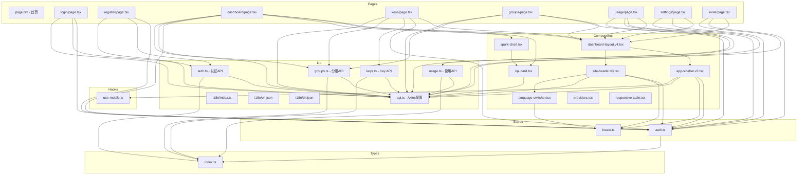

# PROJECT_INDEX.md - GEB L1 项目索引

> **本文件是 GEB L1 索引，任何项目结构或重要文件变更后必须更新我**
> 最后更新: 2026-05-23

## 项目概述

Sub2API Web 是 Sub2API AI Gateway 平台的前端应用，为用户提供 API Key 管理和 Token 使用追踪功能。采用现代 shadcn/ui 组件库构建，支持中英双语切换。Dashboard 采用 Tremor Blocks 风格的 KPI 组件。

## 架构概述

```
┌─────────────────────────────────────────────────────────────┐
│                     Browser (React App)                      │
├─────────────────────────────────────────────────────────────┤
│  Pages (App Router)    │  Components         │  Stores      │
│  - /                   │  - Sidebar (v3)     │  - auth.ts    │
│  - /login              │  - Header (v3)      │  - locale.ts  │
│  - /register           │  - LanguageSwitch   │              │
│  - /dashboard          │  - Layout (v4)      │              │
│  - /keys               │  - KPICard (Tremor) │              │
│  - /groups             │  - SparkChart       │              │
│  - /usage              │  - ResponsiveTable  │              │
│  - /settings           │  - ResponsiveTable  │              │
│  - /invite             │                     │              │
├─────────────────────────────────────────────────────────────┤
│                 Lib Layer (API + i18n)                       │
│  - auth.ts (认证)     │  - keys.ts (Key)  │  - usage.ts     │
│  - groups.ts (分组)   │  - i18n/ (翻译)   │                 │
│  - en.json            │  - zh.json        │                 │
├─────────────────────────────────────────────────────────────┤
│                     Types (index.ts)                         │
│  - User, ApiKey, UsageLog, DashboardStats, TrendData, etc.  │
├─────────────────────────────────────────────────────────────┤
│                   Backend API (Go + Gin)                     │
│  REST API: /api/v1/auth, /api/v1/keys, /api/v1/usage        │
└─────────────────────────────────────────────────────────────┘
```

## 技术栈

| 层级 | 技术 | 版本 |
|------|------|------|
| 框架 | Next.js (App Router) | 15.2.4 |
| UI库 | shadcn/ui (Base UI) | 4.7.0 |
| 样式 | Tailwind CSS | 4.0 |
| 状态 | Zustand | 4.5.0 |
| HTTP | Axios | 1.6.0 |
| 图表 | Recharts | 3.8.0 |
| 通知 | react-hot-toast | 2.4.0 |
| 图标 | Lucide React | 1.16.0 |
| 字体 | Montserrat + PingFang SC | - |
| 语言 | TypeScript | 5.4.0 |

## 依赖关系图 (Mermaid)



## 目录结构

```
src/
├── app/              # Next.js App Router 页面
│   ├── page.tsx      # 首页 (登录入口)
│   ├── layout.tsx    # 根布局 (字体配置)
│   ├── globals.css   # 全局样式 (CSS变量)
│   ├── login/        # 登录页
│   ├── register/     # 注册页
│   ├── dashboard/    # Dashboard (KPI + 统计图表)
│   ├── keys/         # API Key 管理
│   ├── groups/       # API Key 分组管理
│   ├── usage/        # 使用日志
│   ├── settings/     # 用户设置 (Profile, Password, Language)
│   └── invite/       # 邀请功能 (链接, 统计, 列表)
├── components/       # React 组件
│   ├── app-sidebar.v3.tsx # Sidebar (Mobile Responsive - Sheet drawer)
│   ├── site-header.v3.tsx # Header (Mobile Responsive - hamburger menu)
│   ├── dashboard-layout.v4.tsx # 布局容器 (Mobile Responsive)
│   ├── dashboard-layout.versions.ts # uifork 版本管理
│   ├── language-switcher.tsx # 语言切换按钮
│   ├── providers.tsx    # Provider 配置 (toast + uifork)
│   └── ui/              # shadcn/ui + 自定义组件
│       ├── kpi-card.tsx    # KPI 卡片 (Tremor 风格)
│       ├── spark-chart.tsx # 迷你趋势图
│       ├── responsive-table.tsx # 响应式表格 (Card/Table 双布局)
│       ├── chart.tsx       # Recharts 容器
│       └── ...             # 其他 shadcn 组件
├── stores/           # Zustand 状态
│   ├── auth.ts       # 认证状态
│   └── locale.ts     # 语言状态
├── lib/              # 工具/API
│   ├── api.ts        # Axios 配置
│   ├── auth.ts       # 认证 API
│   ├── keys.ts       # Key CRUD
│   ├── groups.ts     # 分组 CRUD
│   ├── usage.ts      # 使用统计 API
│   ├── i18n/         # 国际化
│   │   ├── index.ts  # useTranslation hook
│   │   ├── en.json   # 英文翻译
│   │   └── zh.json   # 中文翻译
│   └── utils.ts      # 工具函数 (cn)
├── hooks/            # React Hooks
│   └── use-mobile.ts # 移动端检测
└── types/            # TypeScript 类型
    └── index.ts      # 全局类型定义
```

## 关键文件说明

| 文件 | 作用 | 重要程度 |
|------|------|----------|
| `src/types/index.ts` | 全局类型定义，所有 API/组件依赖 | ⭐⭐⭐ |
| `src/lib/api.ts` | Axios 客户端配置，所有 API 基础 | ⭐⭐⭐ |
| `src/stores/auth.ts` | 认证状态，控制登录态 | ⭐⭐⭐ |
| `src/stores/locale.ts` | 语言状态，控制界面语言 | ⭐⭐⭐ |
| `src/lib/i18n/index.ts` | 翻译系统核心 | ⭐⭐⭐ |
| `src/components/ui/responsive-table.tsx` | 响应式表格（移动端卡片/桌面端表格） | ⭐⭐ |
| `src/components/app-sidebar.v3.tsx` | Sidebar (Mobile Responsive) | ⭐⭐ |
| `src/components/site-header.v3.tsx` | Header (Mobile Responsive) | ⭐⭐ |
| `src/components/dashboard-layout.v4.tsx` | 布局容器 (Mobile Responsive) | ⭐⭐ |
| `src/components/ui/kpi-card.tsx` | Tremor 风格 KPI 卡片 | ⭐⭐ |
| `src/components/ui/spark-chart.tsx` | 迷你趋势图组件 | ⭐⭐ |

## API 端点映射

| 前端页面 | 后端端点 | 功能 |
|----------|----------|------|
| `/login` | `/auth/login` | 用户登录 |
| `/register` | `/auth/register` | 用户注册 |
| `/dashboard` | `/usage/dashboard/stats` | 统计摘要 |
| `/dashboard` | `/usage/dashboard/trend` | 7天趋势 |
| `/dashboard` | `/usage/dashboard/models` | 模型分布 |
| `/keys` | `/keys` (CRUD) | Key 管理 |
| `/groups` | `/groups` (CRUD) | 分组管理 |
| `/usage` | `/usage` (logs) | 使用日志 |

## GEB 自指规则

本文件是 GEB 分型系统的 L1 索引节点。遵循以下规则：

1. **结构变更触发更新**: 任何新增/删除目录或重要文件时，必须更新本文档
2. **依赖同步**: 当依赖关系变化（如新增 API、修改 store）时，更新 Mermaid 图
3. **技术栈变更**: 当 package.json 有重大依赖变更时，更新技术栈表
4. **文件关联**: 本文件引用的任何子目录，必须有其对应的 `_dir.md`

---

*生成于 GEB 分型初始化 - 运行 `/geb-check` 验证完整性*