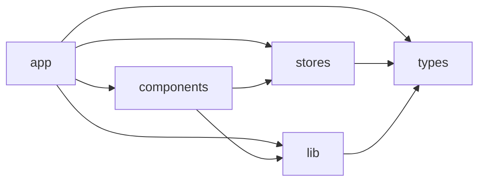

# _dir.md - src 目录索引

> **本文件夹内容变更时必须同步更新本 _dir.md**
> 最后更新: 2026-05-14

## 目录目的

`src/` 是 Sub2API Web 的源代码根目录，包含所有前端业务代码。采用 Next.js App Router 架构组织。

## 子目录结构

| 子目录 | 用途 | 输入 | 输出 |
|--------|------|------|------|
| `app/` | Next.js App Router 页面路由 | 用户请求 | HTML/React 组件 |
| `components/` | 可复用 React 组件 | props/state | UI 元素 |
| `stores/` | Zustand 状态管理 | actions | state |
| `lib/` | API 客户端与工具函数 | API 参数 | API 响应 |
| `types/` | TypeScript 类型定义 | - | 类型导出 |

## 主要文件

- 无直接源文件，仅包含子目录

## 依赖关系

## 入口点

- `app/layout.tsx` - Next.js 根布局，挂载 HeroUI Provider
- `app/page.tsx` - 应用首页入口

## GEB 自指规则

当发生以下变更时，必须更新本文件：
- 新增/删除子目录
- 子目录用途发生变化
- 新增顶级入口文件