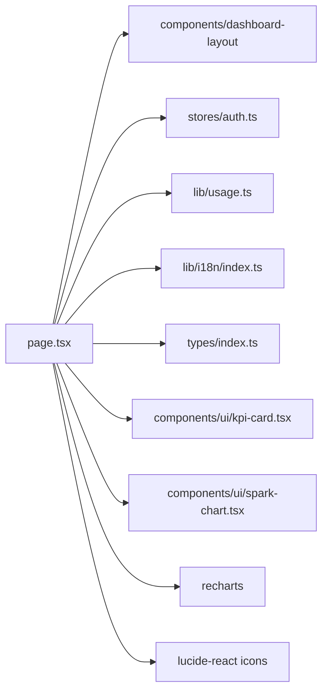

# _dir.md - src/app/dashboard 目录索引

> **本文件夹内容变更时必须同步更新本 _dir.md**
> 最后更新: 2026-05-18

## 目录目的

`src/app/dashboard/` 是用户仪表板页面，展示 API 使用统计数据和图表。采用 Tremor Blocks 风格的 KPI 组件设计。

## 文件清单

| 文件 | 作用 |
|------|------|
| `page.tsx` | Dashboard 页面组件 (Tremor 风格) |

## 页面功能

- SaaS 布局 (DashboardLayout + Sidebar)
- Tremor 风格 KPI 卡片 (带趋势指示 + 迷你图):
  - API Keys (Key 图标)
  - Requests (Activity 图标 + Spark Area)
  - Tokens (Coins 图标 + Spark Area)
  - Cost (DollarSign 图标 + Spark Bar)
  - Avg Duration (Clock 图标)
  - Today Usage (Zap 图标)
- 使用趋势折线图 (Recharts LineChart, 7天)
- 模型请求分布饼图 (Recharts PieChart)
- Token 分布环形图 (输入/输出/缓存)
- 模型费用排行柱状图 (Recharts BarChart, 横向)

## 依赖关系

## API 调用

并行请求三个 API：
- `usageApi.getDashboardStats()` - 统计摘要数据
- `usageApi.getDashboardTrend()` - 7天趋势数据
- `usageApi.getDashboardModels()` - 模型分布数据

## i18n 翻译键

使用 `useTranslation` hook，主要键值：
- `dashboard.totalApiKeys`, `dashboard.totalRequests`, `dashboard.totalTokens`, `dashboard.totalCost`
- `dashboard.usageTrend`, `dashboard.last7Days`
- `dashboard.requestsByModel`, `dashboard.tokenDistribution`, `dashboard.costByModel`
- `dashboard.vsLastWeek` (趋势对比标签)

## GEB 自指规则

变更时更新：
- KPI 卡片内容或样式变化
- 图表类型变化
- API 调用变化
- i18n 翻译键变化
- 依赖组件变化 (kpi-card, spark-chart)