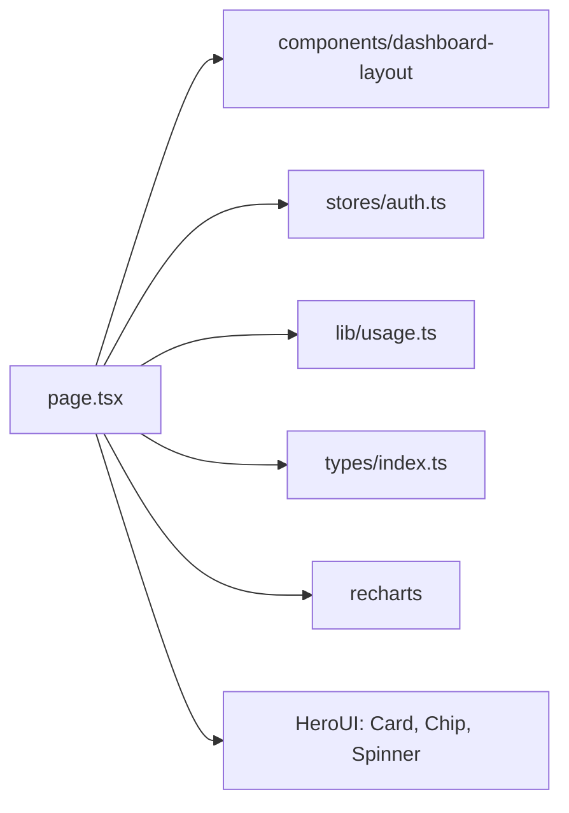

# _dir.md - src/app/dashboard 目录索引

> **本文件夹内容变更时必须同步更新本 _dir.md**
> 最后更新: 2026-05-14

## 目录目的

`src/app/dashboard/` 是用户仪表板页面，展示 API 使用统计数据和图表。

## 文件清单

| 文件 | 作用 |
|------|------|
| `page.tsx` | Dashboard 页面组件 |

## 页面功能

- SaaS 布局 (DashboardLayout + Sidebar)
- 统计卡片: API Keys, Requests, Tokens, Cost
- 今日使用统计
- 使用趋势折线图 (Recharts LineChart)
- 模型使用饼图 (Recharts PieChart)

## 依赖关系

## API 调用

并行请求三个 API：
- `usageApi.getDashboardStats()` - 统计数据
- `usageApi.getDashboardTrend()` - 趋势数据
- `usageApi.getDashboardModels()` - 模型分布

## GEB 自指规则

变更时更新：
- 统计卡片内容变化
- 图表类型变化
- API 调用变化
- 依赖组件变化