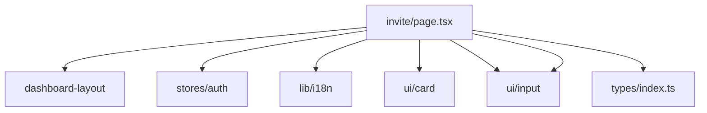

# src/app/invite/_dir.md

> **本文件夹内容变更时必须同步更新本 _dir.md**

## 目录目的

邀请功能页面 - 用户邀请链接、邀请统计、邀请列表管理。

## 文件清单

| 文件 | 作用 | 依赖 |
|------|------|------|
| `page.tsx` | 邀请页面组件，展示邀请链接、统计、规则 | dashboard-layout, stores/auth, lib/i18n, ui/card |

## 输入/输出

- **输入**: 用户邀请码（从 User 类型）、邀请统计数据
- **输出**: 邀请链接复制、邀请统计展示

## 依赖关系

## 变更同步规则

- 邀请字段变化时 → 同步 `types/index.ts` 的 InviteStats、Invitee 类型
- 翻译键变化时 → 同步 `lib/i18n/en.json`、`lib/i18n/zh.json` 的 invite 部分