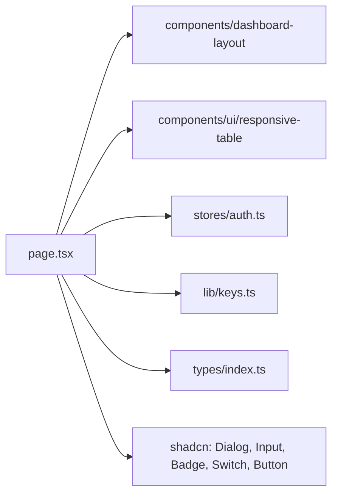

# _dir.md - src/app/keys 目录索引

> **本文件夹内容变更时必须同步更新本 _dir.md**
> 最后更新: 2026-05-21

## 目录目的

`src/app/keys/` 是 API Key 管理页面，提供 Key 的 CRUD 操作。

## 文件清单

| 文件 | 作用 |
|------|------|
| `page.tsx` | API Keys 管理页面组件 |

## 页面功能

- SaaS 布局 (DashboardLayout + Sidebar)
- 响应式表格 (ResponsiveTable: Mobile Card / Desktop Table)
- Key 列表表格
- 创建 Key 模态框 (Modal + Input)
- 编辑 Key 模态框 (Modal + Input)
- 删除确认
- 启用/禁用切换
- Key 显示/复制 (Popover)
- 移动端卡片布局 (cardTitle + cardActions)

## 依赖关系

## API 调用

- `keysApi.list()` - 加载 Key 列表
- `keysApi.create()` - 创建新 Key
- `keysApi.update()` - 更新 Key
- `keysApi.delete()` - 删除 Key
- `keysApi.toggleStatus()` - 启用/禁用

## GEB 自指规则

变更时更新：
- Key 操作功能变化
- 模态框内容变化
- API 调用变化
- 依赖组件变化