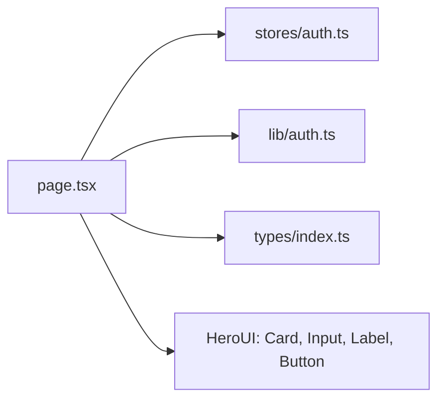

# _dir.md - src/app/login 目录索引

> **本文件夹内容变更时必须同步更新本 _dir.md**
> 最后更新: 2026-05-14

## 目录目的

`src/app/login/` 是用户登录页面路由，提供邮箱+密码登录表单。

## 文件清单

| 文件 | 作用 |
|------|------|
| `page.tsx` | 登录页面组件 |

## 页面功能

- HeroUI Card 容器
- Email + Password 输入框 (HeroUI Input + Label)
- 登录按钮
- 注册链接跳转

## 依赖关系

## API 调用

成功登录后：
1. 存储 token 到 localStorage
2. 更新 `useAuthStore` user 状态
3. 跳转 `/dashboard`

## GEB 自指规则

变更时更新：
- 登录表单字段变化
- API 调用逻辑变化
- 依赖组件变化