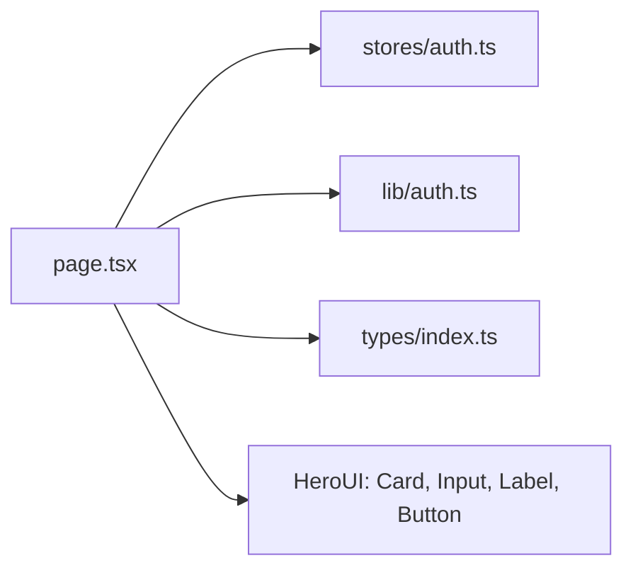

# _dir.md - src/app/register 目录索引

> **本文件夹内容变更时必须同步更新本 _dir.md**
> 最后更新: 2026-05-14

## 目录目的

`src/app/register/` 是用户注册页面路由，提供用户名+邮箱+密码注册表单。

## 文件清单

| 文件 | 作用 |
|------|------|
| `page.tsx` | 注册页面组件 |

## 页面功能

- HeroUI Card 容器
- Username + Email + Password 输入框 (HeroUI Input + Label)
- 邀请码输入 (可选，根据 `PublicSettings.invitation_required`)
- 促销码输入 (可选)
- 注册按钮
- 登录链接跳转

## 依赖关系

## API 调用

1. 加载时获取 `PublicSettings` (判断是否需要邀请码)
2. 注册成功后跳转 `/dashboard`

## GEB 自指规则

变更时更新：
- 注册表单字段变化
- API 调用逻辑变化
- 依赖组件变化