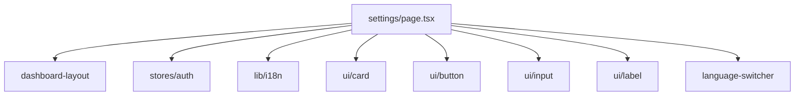

# src/app/settings/_dir.md

> **本文件夹内容变更时必须同步更新本 _dir.md**

## 目录目的

用户设置页面 - 个人信息修改、密码修改、语言偏好设置。

## 文件清单

| 文件 | 作用 | 依赖 |
|------|------|------|
| `page.tsx` | 设置页面组件，包含 Profile、Password、Language 三个区块 | dashboard-layout, stores/auth, lib/i18n, ui/card |

## 输入/输出

- **输入**: 用户信息（从 User 类型）、语言偏好
- **输出**: 用户信息修改、密码修改、语言切换

## 依赖关系

## 变更同步规则

- 设置字段变化时 → 同步 `lib/i18n/en.json`、`lib/i18n/zh.json` 的 settings 部分
- 新增设置区块时 → 在本 _dir.md 文件清单中添加