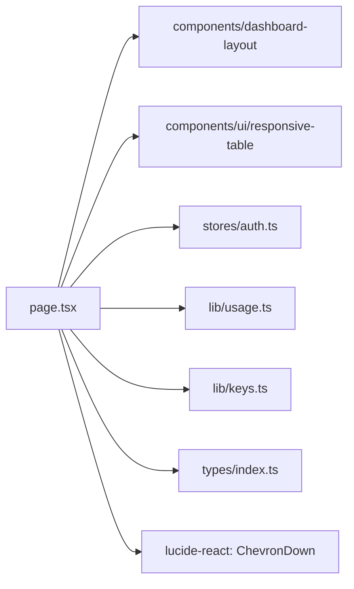

# _dir.md - src/app/usage 目录索引

> **本文件夹内容变更时必须同步更新本 _dir.md**
> 最后更新: 2026-05-21

## 目录目的

`src/app/usage/` 是使用日志页面，展示 API 调用日志列表。

## 文件清单

| 文件 | 作用 |
|------|------|
| `page.tsx` | Usage 日志页面组件 |

## 页面功能

- SaaS 布局 (DashboardLayout + Sidebar)
- 响应式表格 (ResponsiveTable: Mobile Card / Desktop Table)
- 日志列表表格
- API Key 筛选器 (自定义 select + lucide-react ChevronDown 图标)
- 分页导航
- 日志详情: 时间, Key, 模型, 类型, Tokens, Cost, Duration, Status
- 移动端卡片布局 (cardTitle 显示 model + time)

## 设计系统

页面样式基于 Paper MCP 设计文件:
- 字体: Montserrat
- 颜色: #1D3025 (主色), #5C7064 (辅助), #D3DED8 (边框)
- Model badge: #1F5134 bg, #F2ECD9 text
- Status badge: #C91D2B bg, #FCF7E8 text

## 依赖关系

## API 调用

- `usageApi.listLogs()` - 加载日志列表
- `keysApi.list()` - 加载 Key 列表用于筛选

## GEB 自指规则

变更时更新：
- 日志字段变化
- 篮选功能变化
- API 调用变化
- 依赖组件变化
- Paper 设计样式变化