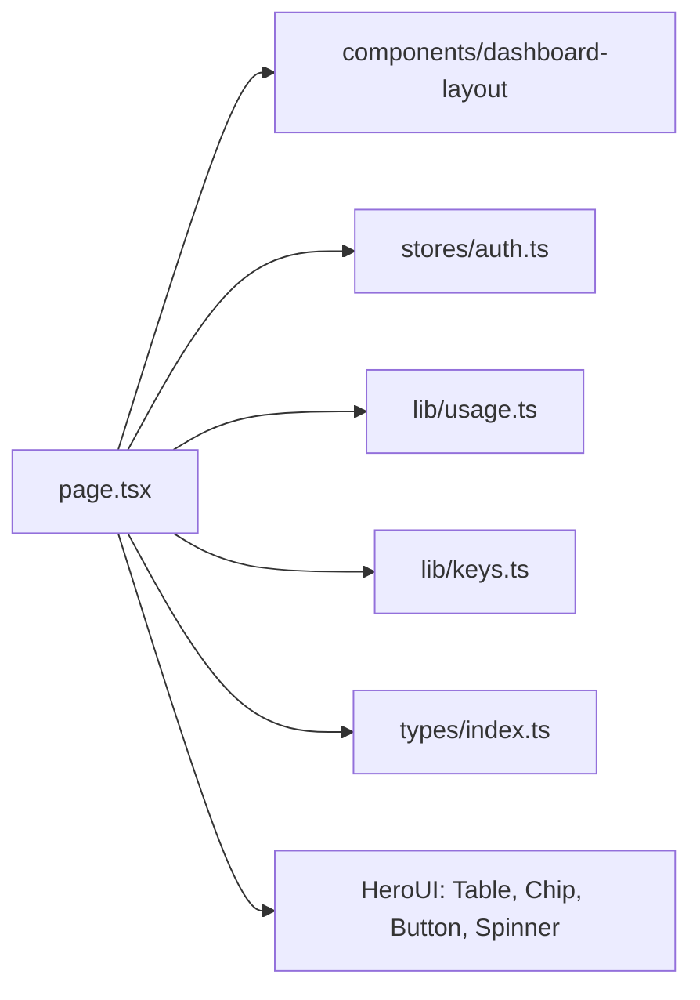

# _dir.md - src/app/usage 目录索引

> **本文件夹内容变更时必须同步更新本 _dir.md**
> 最后更新: 2026-05-14

## 目录目的

`src/app/usage/` 是使用日志页面，展示 API 调用日志列表。

## 文件清单

| 文件 | 作用 |
|------|------|
| `page.tsx` | Usage 日志页面组件 |

## 页面功能

- SaaS 布局 (DashboardLayout + Sidebar)
- 日志列表表格 (HeroUI Table)
- API Key 筛选器 (原生 select)
- 分页导航
- 日志详情: 时间, Key, 模型, 类型, Tokens, Cost, Duration, Status

## 依赖关系

## API 调用

- `usageApi.listLogs()` - 加载日志列表
- `keysApi.list()` - 加载 Key 列表用于筛选

## GEB 自指规则

变更时更新：
- 日志字段变化
- 筛选功能变化
- API 调用变化
- 依赖组件变化