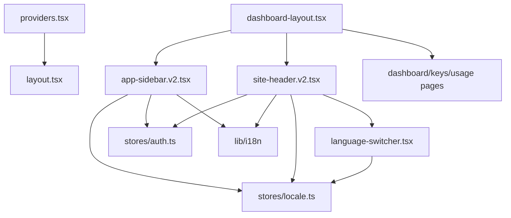

# _dir.md - src/components 目录索引

> **本文件夹内容变更时必须同步更新本 _dir.md**
> 最后更新: 2026-05-16

## 目录目的

`src/components/` 存放可复用 React 组件，包括布局骨架、导航、Provider 等基础设施组件。

## 文件清单

| 文件 | 作用 | 输入 | 输出 | 使用者 |
|------|------|------|------|--------|
| `app-sidebar.v2.tsx` | Sidebar (Paper Design) | `isCollapsed`, `setIsCollapsed` | 收拢导航 | `dashboard-layout.tsx` |
| `site-header.v2.tsx` | Header (Paper Design) | `user` state | Header + 语言切换 | `dashboard-layout.tsx` |
| `language-switcher.tsx` | 语言切换下拉 | `locale` state | 🇺🇸/🇨🇳 切换 | `site-header.v2.tsx` |
| `dashboard-layout.tsx` | Dashboard 布局容器 | children | Sidebar + Header + Main | 所有认证页面 |
| `providers.tsx` | shadcn/ui Provider 包装 | children | Base UI 上下文 | `app/layout.tsx` |
| `ui/` | shadcn/ui 组件库 | - | Button, Card, Dialog 等 | 多处引用 |

## 组件依赖图

## 关键设计

### dashboard-layout.tsx
- 固定左侧 Sidebar (可收拢: 52px / 展开: 200px)
- 顶部 Header (56px)
- 主内容区自适应

### app-sidebar.v2.tsx (Paper Design)
- Logo 区域 (56px)
- 收拢宽度: 52px (居中对齐图标)
- 导航菜单: Dashboard, API Keys, Usage
- 用户头像 + 名称 + 余额
- 收起/展开按钮
- 使用 `useTranslation` 获取翻译

### site-header.v2.tsx (Paper Design)
- Logo + 标题
- 语言切换下拉 (🇺🇸/🇨🇳)
- 用户下拉菜单 (设置/退出)

### language-switcher.tsx
- DropdownMenu 组件
- 语言选项: English (🇺🇸), 中文 (🇨🇳)
- 使用 `useLocaleStore` 切换语言

## GEB 自指规则

当发生以下变更时，必须更新本文件：
- 新增/删除组件文件
- 组件功能用途发生变化
- 组件依赖关系变化
- Paper 设计样式变化需同步组件样式