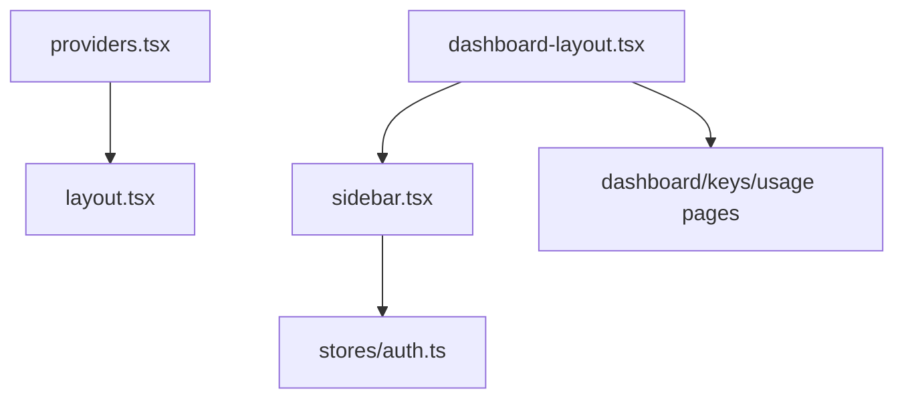

# _dir.md - src/components 目录索引

> **本文件夹内容变更时必须同步更新本 _dir.md**
> 最后更新: 2026-05-14

## 目录目的

`src/components/` 存放可复用 React 组件，包括布局骨架、导航、Provider 等基础设施组件。

## 文件清单

| 文件 | 作用 | 输入 | 输出 | 使用者 |
|------|------|------|------|--------|
| `sidebar.tsx` | SaaS 左侧导航栏 | `user` state | 导航 UI | `dashboard-layout.tsx` |
| `dashboard-layout.tsx` | Dashboard 布局容器 | children | Sidebar + Main | 所有认证页面 |
| `providers.tsx` | HeroUI Provider 包装 | children | HeroUI 上下文 | `app/layout.tsx` |
| `nav.tsx` | 顶部导航组件 | user state | Nav UI | (待使用) |

## 组件依赖图

## 关键设计

### dashboard-layout.tsx
- 固定左侧 Sidebar (256px)
- 主内容区 `ml-64` 偏移
- 包含用户信息展示

### sidebar.tsx
- Logo 区域
- 导航菜单: Dashboard, API Keys, Usage
- 用户头像 + 名称 + 退出按钮
- 使用 `useAuthStore` 获取用户信息

## GEB 自指规则

当发生以下变更时，必须更新本文件：
- 新增/删除组件文件
- 组件功能用途发生变化
- 组件依赖关系变化