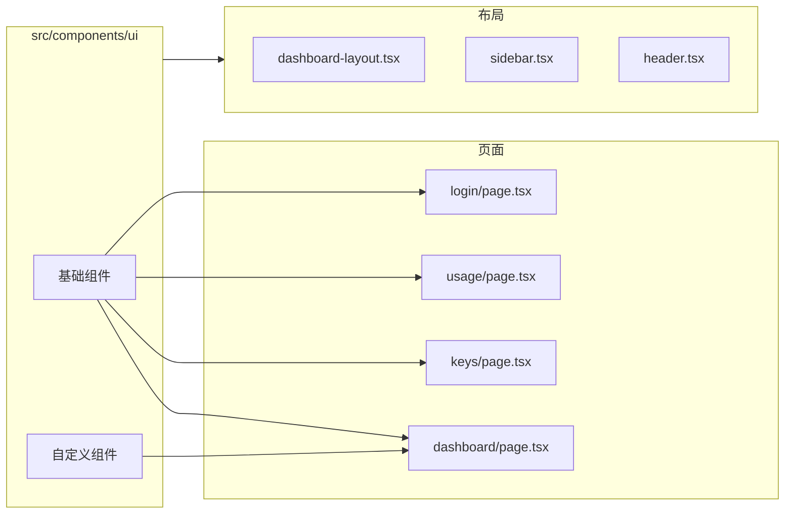

# src/components/ui 目录索引

> **本文件夹内容变更时必须同步更新本 _dir.md**

## 目录用途
存放 shadcn/ui 基础组件和自定义 UI 组件，包含按钮、卡片、表单、图表等通用组件。

## 文件清单

### 基础组件 (shadcn/ui)
| 文件 | 作用 | 依赖 |
|------|------|------|
| `avatar.tsx` | 用户头像组件 | @radix-ui/react-avatar |
| `badge.tsx` | 状态标签/徽章 | cn, class-variance-authority |
| `button.tsx` | 按钮（多 variant） | @radix-ui/react-slot, class-variance-authority |
| `card.tsx` | 卡片容器 | cn |
| `chart.tsx` | Recharts 图表容器 | recharts |
| `dialog.tsx` | 对话框/模态框 | @radix-ui/react-dialog |
| `dropdown-menu.tsx` | 下拉菜单 | @radix-ui/react-dropdown-menu |
| `input.tsx` | 输入框 | cn |
| `label.tsx` | 表单标签 | @radix-ui/react-label |
| `separator.tsx` | 分隔线 | @radix-ui/react-separator |
| `sheet.tsx` | 侧边抽屉 | @radix-ui/react-dialog |
| `sidebar.tsx` | 侧边栏容器 | @radix-ui/react-dialog |
| `skeleton.tsx` | 加载骨架 | cn |
| `switch.tsx` | 开关切换 | @radix-ui/react-switch |
| `table.tsx` | 数据表格 | cn |
| `tooltip.tsx` | 提示气泡 | @radix-ui/react-tooltip |

### 自定义组件 (Tremor Blocks 风格)
| 文件 | 作用 | 依赖 |
|------|------|------|
| `kpi-card.tsx` | KPI 统计卡片（带趋势+迷你图） | @radix-ui/react-slot, lucide-react |
| `spark-chart.tsx` | 迷你趋势图 (Area/Line/Bar) | recharts |

## 输入/输出
- **输入**: 无（纯 UI 组件库）
- **输出**: 被 `app/*` 和 `components/*` 所有页面和布局组件导入使用

## Mermaid 依赖图

## 变更同步规则
- 新增组件 → 在本文件清单中添加记录
- 组件 API 变化 → 更新对应组件的 L3 注释块
- 组件删除 → 从清单中移除，检查所有引用页面

---
*最后更新: 2026-05-18*