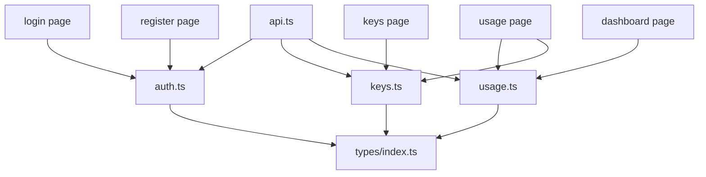

# _dir.md - src/lib 目录索引

> **本文件夹内容变更时必须同步更新本 _dir.md**
> 最后更新: 2026-05-14

## 目录目的

`src/lib/` 存放 API 客户端与工具函数，封装后端 REST API 调用逻辑。

## 文件清单

| 文件 | 作用 | 端点 | 使用者 |
|------|------|------|--------|
| `api.ts` | Axios 客户端配置 | 基础配置 | 所有 API lib |
| `auth.ts` | 认证 API | `/auth/*` | login/register pages |
| `keys.ts` | API Key CRUD | `/keys` | keys page |
| `usage.ts` | 使用统计 API | `/usage/*` | dashboard/usage pages |

## API 模块详情

### api.ts (基础配置)
```typescript
// Axios 实例
const api = axios.create({
  baseURL: process.env.NEXT_PUBLIC_API_URL || '/api/v1',
});

// Token 自动注入拦截器
// 401 自动刷新/登出处理
```

### auth.ts
- `login({ email, password })` → `/auth/login`
- `register({ username, email, password, ... })` → `/auth/register`
- `getPublicSettings()` → `/auth/settings`

### keys.ts
- `list(page, pageSize)` → GET `/keys`
- `create(payload)` → POST `/keys`
- `update(id, payload)` → PUT `/keys/:id`
- `delete(id)` → DELETE `/keys/:id`
- `toggleStatus(id, status)` → PUT `/keys/:id/status`

### usage.ts
- `listLogs(params)` → GET `/usage`
- `getDashboardStats()` → GET `/usage/dashboard/stats`
- `getDashboardTrend(params)` → GET `/usage/dashboard/trend`
- `getDashboardModels()` → GET `/usage/dashboard/models`

## 依赖关系



## GEB 自指规则

当发生以下变更时，必须更新本文件：
- 新增 API 模块文件
- API 端点路径变化
- api.ts 配置变化 (如 baseURL)