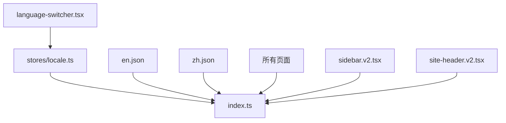

# _dir.md - src/lib/i18n 目录索引

> **本文件夹内容变更时必须同步更新本 _dir.md**
> 最后更新: 2026-05-16

## 目录目的

`src/lib/i18n/` 存放国际化系统，包括翻译 hook 和中英双语 JSON 字典。

## 文件清单

| 文件 | 作用 | 使用者 |
|------|------|--------|
| `index.ts` | `useTranslation` hook + 翻译逻辑 | 所有页面和组件 |
| `en.json` | 英文翻译字典 | `index.ts` |
| `zh.json` | 中文翻译字典 | `index.ts` |

## i18n 模块详情

### index.ts (核心)
```typescript
// useTranslation hook
export function useTranslation() {
  const { locale } = useLocaleStore();
  return {
    translate: (key: string) => string,  // 支持嵌套键如 'header.dashboard'
    locale: 'en' | 'zh'
  };
}
```

### 翻译键结构
```json
{
  "common": { "login", "register", "logout" },
  "auth": { "loginTitle", "email", "password" },
  "dashboard": { "title", "welcome", "totalApiKeys" },
  "keys": { "title", "createNew", "name", "status" },
  "usage": { "title", "model", "tokens", "cost" },
  "header": { "dashboard", "apiKeys", "usage" },
  "sidebar": { "collapse" },
  "language": { "switch", "en", "zh" }
}
```

## 依赖关系



## GEB 自指规则

当发生以下变更时，必须更新本文件：
- 新增翻译键（需更新 en.json 和 zh.json 同步）
- 新增语言文件（如 ja.json）
- `useTranslation` hook 接口变化