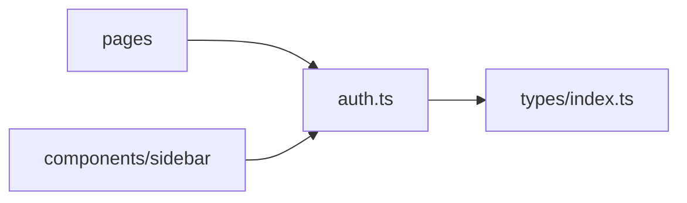

# _dir.md - src/stores 目录索引

> **本文件夹内容变更时必须同步更新本 _dir.md**
> 最后更新: 2026-05-14

## 目录目的

`src/stores/` 存放 Zustand 状态管理 store，负责全局状态（如认证信息）的存储与同步。

## 文件清单

| 文件 | 作用 | 状态字段 | 使用者 |
|------|------|----------|--------|
| `auth.ts` | 认证状态管理 | `user`, `isAuthenticated` | 所有页面, sidebar |

## auth.ts 详情

### 状态字段
```typescript
interface AuthState {
  user: User | null;
  isAuthenticated: boolean;
  checkAuth: () => void;     // 检查 localStorage token
  setUser: (user: User) => void;
  logout: () => void;
}
```

### 存储位置
- `localStorage.auth_token` - JWT Access Token
- `localStorage.refresh_token` - JWT Refresh Token
- `localStorage.auth_user` - 用户 JSON

### 依赖关系


## GEB 自指规则

当发生以下变更时，必须更新本文件：
- 新增 store 文件
- auth.ts 状态字段变化
- 存储方式变化 (如改用 cookie)