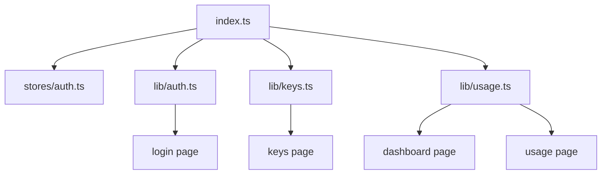

# _dir.md - src/types 目录索引

> **本文件夹内容变更时必须同步更新本 _dir.md**
> 最后更新: 2026-05-14

## 目录目的

`src/types/` 存放 TypeScript 类型定义，是整个项目的类型中枢，所有 API 响应、组件 props 都依赖此目录。

## 文件清单

| 文件 | 作用 | 导出类型数 |
|------|------|------------|
| `index.ts` | 全局类型定义 | ~20 |

## 类型分类

### API 响应类型
- `ApiResponse<T>` - 通用 API 响应包装
- `PaginatedResponse<T>` - 分页数据结构

### 用户与认证
- `User` - 用户信息
- `LoginRequest` - 登录请求体
- `RegisterRequest` - 注册请求体
- `AuthResponse` - 认证响应 (token + user)
- `PublicSettings` - 公开设置 (注册配置)

### API Key
- `ApiKey` - Key 实体
- `CreateApiKeyRequest` - 创建请求
- `UpdateApiKeyRequest` - 更新请求

### 使用统计
- `UserDashboardStats` - Dashboard 统计数据
- `TrendDataPoint` - 时间趋势数据点
- `TrendResponse` - 趋势响应
- `ModelStat` - 模型统计
- `ModelStatsResponse` - 模型统计响应
- `UsageLog` - 使用日志条目

## 依赖关系

## GEB 自指规则

当发生以下变更时，必须更新本文件：
- 新增类型定义
- 类型字段变化 (与后端 API 响应同步)
- 新增类型文件

**重要**: 此文件是全项目类型中枢，任何变更会影响多个页面和 API 模块。